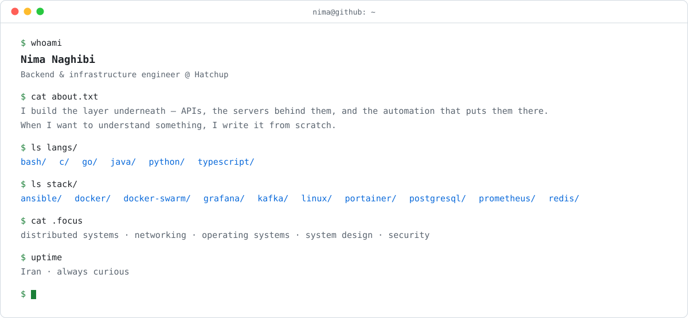

<picture>
  <source media="(prefers-color-scheme: dark)" srcset="assets/terminal-dark.svg">
  
</picture>

```console
$ cat about.txt
I build the layer underneath — APIs, the servers behind them,
and the automation that puts them there. When I want to
understand something, I write it from scratch.

$ ls langs/
go/   python/   c/   typescript/

$ ls stack/
linux/   docker/   ansible/   postgresql/   redis/

$ cat .focus
distributed systems · security

$ uptime
Iran · always curious
```
